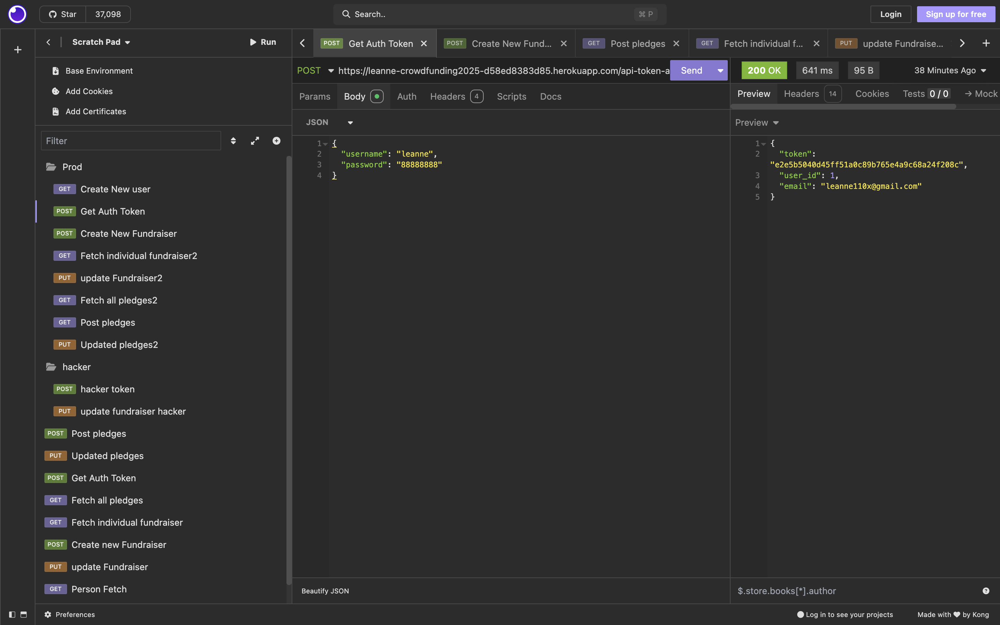
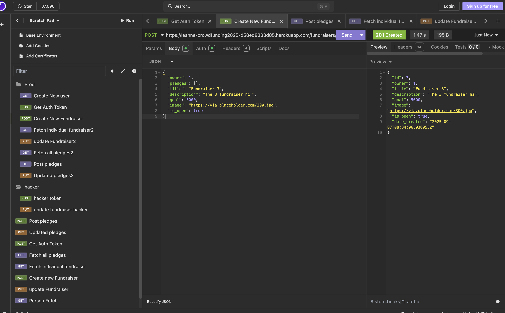

## Crowdfunding Back End

Leanne Huang

## Planning:

### Concept/Name

{{ Treasure bowl is an online platform where individuals, groups, or organizations can raise money for personal needs, creative projects, startups, or charitable causes by collecting small contributions from a large number of people. It typically lets campaign creators set a fundraising goal, share their story, add images, and accept secure online donations }}

### Intended Audience/User Stories

1. Individuals – people raising funds for personal needs (medical bills, education, emergencies).

2. Nonprofits & Charities – organizations running campaigns to support community projects, humanitarian work, or disaster relief.

3. Entrepreneurs & Creators – startups, inventors, or artists seeking backing for new products, creative works, or innovations.

4. Supporters/Donors – friends, family, and the wider public who want to contribute financially to causes they believe in.

### Front End Pages/Functionality

- Home Page
  - Featured kickstarters
- Search page
  -Search
- Create New Fundraiser details
- Form with fundraiser details
- Ability to submit
  Nice error pages for validation

- {{ A page on the front end }}
  - {{ A list of dot-points showing functionality is available on this page }}
  - {{ etc }}
  - {{ etc }}
- {{ A second page available on the front end }}
  - {{ Another list of dot-points showing functionality }}
  - {{ etc }}

### API Spec

#### User endpoint

| URL             | HTTP Method                              | Purpose | Request Body | Success Response Code | Authentication/Authorisation |
| --------------- | ---------------------------------------- | ------- | ------------ | --------------------- | ---------------------------- |
| /users          | Create new user                          | POST    | JSON payload | 201                   | None                         |
| /users/{userId} | Get individual user information          | GET     | None         | 200                   | None                         |
| /users          | Get all users information                | GET     | None         | 200                   | None                         |
| /api-token-auth | obtain a token along with user's details | POST    | JSON payload | 200                   | Any registered user          |

JSON example for create new user
`{
	"username":"newuser0906",
	"password":"12345678",
	"first_name":"rich",
	"last_name":"money",
	"email":"example@com.au"
}`

JSON example for obtain token with user details
`{
	"username":"newuser0906",
	"password":"12345678",}
`

#### Fundraisers endpoint

| URL               | HTTP Method                     | Purpose | Request Body | Success Response Code | Authentication/Authorisation |
| ----------------- | ------------------------------- | ------- | ------------ | --------------------- | ---------------------------- |
| /fundraisers      | Fetch all the fundraisers       | GET     | N/A          | 200                   | None                         |
| /fundraisers/{id} | Fetch individual the fundraiser | GET     | N/A          | 200                   | None                         |
| /fundraisers      | Create a new fundraisers        | POST    | JSON PayLoad | 200                   | Any logged in user           |
| /fundraisers      | Update a existing fundraisers   | PUT     | JSON PayLoad | 200                   | Any logged in user           |

JSON example for create new fundraisers
`{
	"id": 2,
	"owner": 1,
	"title": "Fundraiser 2nd ",
	"description": "The first fundraiser hi 2nd hahahha",
	"goal": 8000,
	"image": "https://via.placeholder.com/300.jpg",
	"is_open": true,
	"date_created": "2025-09-06T14:51:19.184190Z"
}`

#### Pledges endpoint

| URL      | HTTP Method                             | Purpose | Request Body | Success Response Code | Authentication/Authorisation |
| -------- | --------------------------------------- | ------- | ------------ | --------------------- | ---------------------------- |
| /pledges | Fetch all the pledges                   | GET     | N/A          | 200                   |                              |
| /pledges | Create new pledge for a fundraiser      | POST    | JSON payload | 201                   | Any logged in user           |
| /pledges | Update existing pledge for a fundraiser | PUT     | JSON payload | 201                   | Any logged in user           |

JSON example for create existing pledge
`{
	"amount": 80,
	"comment": "pledge five",
	"anonymous": true,
	"fundraiser": 1
}`

JSON example for update existing pledge
`	{
		"id": 1,
		"supporter": 1,
		"amount": 10,
		"comment": "happy",
		"anonymous": false,
		"fundraiser": 1
	}`

### DB Schema

### Screenshot of API Call

get user token

create a new fundraiser - POST

get all pledges - GET

